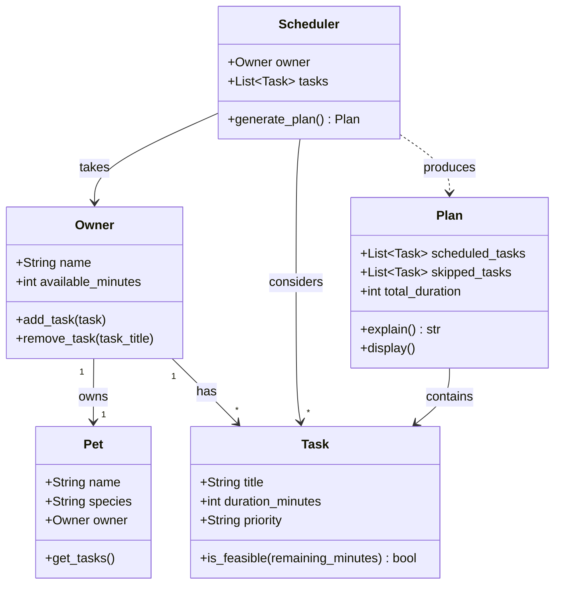

# PawPal+ Project Reflection

## 1. System Design

The three core actions a user should be able to perform in PawPal+ are:

1. **Set up their pet profile** — Before any scheduling can happen, the user enters basic information about themselves and their pet: owner name, pet name, species, and how much time they have available in the day. This context shapes everything the scheduler does downstream.

2. **Add and manage care tasks** — The user builds a list of tasks that need to happen (such as a morning walk, feeding, medication, or grooming). Each task has a title, an estimated duration in minutes, and a priority level (low, medium, or high). The user can add as many tasks as needed to reflect their pet's real care requirements.

3. **Generate and view today's schedule** — Once tasks are entered, the user triggers the scheduler to produce an ordered daily plan. The plan fits tasks within the available time, ranks them by priority, and explains the reasoning behind each decision (for example, why a high-priority medication task was placed before a lower-priority enrichment activity).

---

**a. Initial design**

- Briefly describe your initial UML design.

We are designing a pet care app with four core classes: **Owner** (holds the user's name and available time), **Pet** (holds the pet's name and species), **Task** (represents a single care activity with duration and priority), and **Scheduler** (takes the owner and task list and produces an ordered daily plan with reasoning).

- What classes did you include, and what responsibilities did you assign to each?

The initial design includes five classes. **Task** (dataclass) holds a single care activity — its title, duration in minutes, and priority — and can check whether it fits within remaining time. **Pet** (dataclass) stores the pet's name and species and holds a reference back to its owner. **Owner** is the central hub: it stores the owner's name, available time for the day, and the full list of tasks to be completed. **Scheduler** takes an owner and their tasks and runs the scheduling algorithm, returning a **Plan**. **Plan** holds the result: which tasks were scheduled, which were skipped, the total duration used, and methods to explain and display the outcome.

**b. Design changes**

After reviewing the skeleton, two issues were identified and one change was made:

1. **`Scheduler` no longer takes a separate `tasks` argument** — tasks are already stored on `Owner.tasks`, so passing them in separately created two sources of truth. The `Scheduler` now reads `owner.tasks` directly, removing the redundancy.

2. **`Pet.get_tasks()` was removed** — `Pet` had no task list of its own and its `owner` reference was optional, so the method had nowhere to look. Tasks belong to `Owner`, not `Pet`, so this method was misleading. It was dropped to keep responsibilities clear.

These changes were made because the original design allowed inconsistency (two task lists) and included a method that could never work correctly without a fragile back-reference chain.

- Did your design change during implementation?
- If yes, describe at least one change and why you made it.

---

## 2. Scheduling Logic and Tradeoffs

**a. Constraints and priorities**

- What constraints does your scheduler consider (for example: time, priority, preferences)?
- How did you decide which constraints mattered most?

**b. Tradeoffs**

- Describe one tradeoff your scheduler makes.
- Why is that tradeoff reasonable for this scenario?

---

## 3. AI Collaboration

**a. How you used AI**

- How did you use AI tools during this project (for example: design brainstorming, debugging, refactoring)?
- What kinds of prompts or questions were most helpful?

**b. Judgment and verification**

- Describe one moment where you did not accept an AI suggestion as-is.
- How did you evaluate or verify what the AI suggested?

---

## 4. Testing and Verification

**a. What you tested**

- What behaviors did you test?
- Why were these tests important?

**b. Confidence**

- How confident are you that your scheduler works correctly?
- What edge cases would you test next if you had more time?

---

## 5. Reflection

**a. What went well**

- What part of this project are you most satisfied with?

**b. What you would improve**

- If you had another iteration, what would you improve or redesign?

**c. Key takeaway**

- What is one important thing you learned about designing systems or working with AI on this project?
