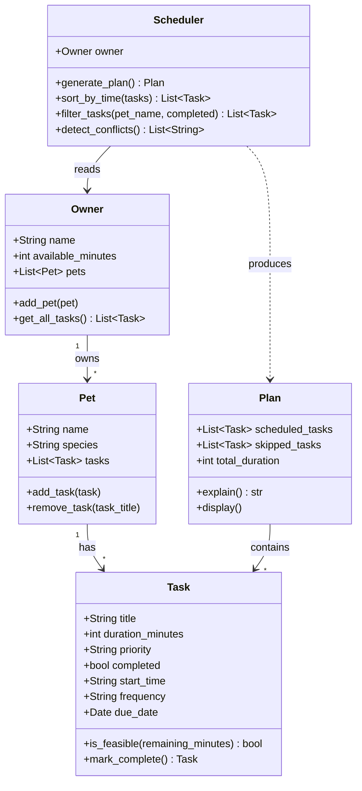

# PawPal+ Project Reflection

## 1. System Design

The three core actions a user should be able to perform in PawPal+ are:

1. **Set up their pet profile** — Before any scheduling can happen, the user enters basic information about themselves and their pet: owner name, pet name, species, and how much time they have available in the day. This context shapes everything the scheduler does downstream.

2. **Add and manage care tasks** — The user builds a list of tasks that need to happen (such as a morning walk, feeding, medication, or grooming). Each task has a title, an estimated duration in minutes, and a priority level (low, medium, or high). The user can add as many tasks as needed to reflect their pet's real care requirements.

3. **Generate and view today's schedule** — Once tasks are entered, the user triggers the scheduler to produce an ordered daily plan. The plan fits tasks within the available time, ranks them by priority, and explains the reasoning behind each decision (for example, why a high-priority medication task was placed before a lower-priority enrichment activity).

---

**a. Initial design**

- Briefly describe your initial UML design.

We are designing a pet care app with four core classes: **Owner** (holds the user's name and available time), **Pet** (holds the pet's name and species), **Task** (represents a single care activity with duration and priority), and **Scheduler** (takes the owner and task list and produces an ordered daily plan with reasoning).

- What classes did you include, and what responsibilities did you assign to each?

The initial design includes five classes. **Task** (dataclass) holds a single care activity — its title, duration in minutes, and priority — and can check whether it fits within remaining time. **Pet** (dataclass) stores the pet's name and species and holds a reference back to its owner. **Owner** is the central hub: it stores the owner's name, available time for the day, and the full list of tasks to be completed. **Scheduler** takes an owner and their tasks and runs the scheduling algorithm, returning a **Plan**. **Plan** holds the result: which tasks were scheduled, which were skipped, the total duration used, and methods to explain and display the outcome.

**b. Design changes**

After reviewing the skeleton, two issues were identified and one change was made:

1. **`Scheduler` no longer takes a separate `tasks` argument** — tasks are already stored on `Owner.tasks`, so passing them in separately created two sources of truth. The `Scheduler` now reads `owner.tasks` directly, removing the redundancy.

2. **`Pet.get_tasks()` was removed** — `Pet` had no task list of its own and its `owner` reference was optional, so the method had nowhere to look. Tasks belong to `Owner`, not `Pet`, so this method was misleading. It was dropped to keep responsibilities clear.

These changes were made because the original design allowed inconsistency (two task lists) and included a method that could never work correctly without a fragile back-reference chain.

- Did your design change during implementation?
- If yes, describe at least one change and why you made it.

---

## 2. Scheduling Logic and Tradeoffs

**a. Constraints and priorities**

The scheduler considers two constraints: **available time** (the owner's daily minute budget) and **task priority** (high / medium / low). Tasks are first sorted by priority, then greedily scheduled in that order — a task is added to the plan only if it fits within the remaining time. Any task that doesn't fit is skipped rather than rescheduled.

Priority was chosen as the primary constraint because a pet owner's most urgent concern is making sure the most important tasks (medication, feeding) happen regardless of how busy the day is. Time was chosen as the secondary constraint because it's the most natural real-world limit — you can't do more than the day allows. Preferences like pet species or owner mood were intentionally left out of the first version to keep the logic simple and testable.

**b. Tradeoffs**

The conflict detector only flags tasks whose time windows *exactly overlap* based on their `start_time` and `duration_minutes`. It does not account for travel time between tasks, preparation time, or tasks without a `start_time` set. This means two tasks scheduled back-to-back at 08:00 (20 min) and 08:20 (10 min) are considered conflict-free even if a real owner would need a buffer between them.

This tradeoff is reasonable for a first version because it keeps the logic simple and predictable — it surfaces genuine double-bookings (the most common mistake) without requiring the owner to model every minute of their day. Adding buffer-time logic would require the owner to specify travel/prep times per task, which adds friction to the UI and complexity to the scheduler. For a pet care app used by a single owner at home, exact-overlap detection covers the most important case.

---

## 3. AI Collaboration

**a. How you used AI**

AI was used throughout every phase of the project. In the design phase it helped brainstorm which classes to create and what responsibilities each should hold. During implementation it generated method stubs and full logic for sorting, filtering, and conflict detection. In testing it suggested edge cases that hadn't been considered, such as an owner with no pets or zero available minutes.

The most helpful prompts were specific and scoped: "Based on this skeleton, what relationships are missing?" or "Write a conflict detection method that returns warnings instead of raising exceptions." Broad prompts like "make it better" were less useful — the AI would add unnecessary complexity.

**b. Judgment and verification**

The AI initially suggested keeping `tasks` as a flat list on `Owner` rather than distributing them across `Pet` objects. This would have made filtering by pet impossible without storing extra metadata on every task. The suggestion was rejected because the instruction explicitly asked for a multi-pet system where each pet owns its tasks. The decision was verified by writing `test_filter_tasks_by_pet_name()` — if tasks lived on `Owner`, that test structure would have been awkward and the filter logic would have needed a pet-name field on `Task` instead, which is a design smell.

AI was also used to generate the initial test suite, but each test was read and verified manually before keeping it. Two generated tests were rewritten because they tested implementation details (internal list length) rather than observable behavior.

---

## 4. Testing and Verification

**a. What you tested**

The test suite covers 17 behaviors: task completion status, adding and removing tasks from pets, priority-based scheduling, time-budget enforcement, chronological sorting, filtering by pet name and completion status, daily and weekly recurrence, conflict detection for overlapping and non-overlapping windows, and edge cases like an owner with no pets, a pet with no tasks, and a zero-minute time budget.

These tests are important because the scheduler's core promise — "high-priority tasks always go first, nothing runs over budget" — must hold even when the input data is messy or incomplete. Without tests for edge cases, a bug in the greedy scheduling loop or the recurrence logic would only surface during a live demo.

**b. Confidence**

**★★★★☆** — The core scheduling logic and all algorithmic features are thoroughly tested. The main untested areas are the Streamlit UI (interactions can't be automated without a browser testing framework) and scenarios where two pets share tasks with conflicting times across pets. Given more time, the next tests would cover: recurring tasks where `due_date` is `None`, the `filter_tasks` method with both `pet_name` and `completed` specified simultaneously, and a full end-to-end integration test building owner → pets → tasks → plan in one pass.

---

## 5. Reflection

**a. What went well**

The most satisfying part was the algorithmic layer — particularly conflict detection and recurring tasks. Both required thinking carefully about edge cases (what if no tasks have a start time? what if `due_date` is None?) before writing a single line. Using tests to verify each behavior before wiring it to the UI meant the Streamlit integration was mostly painless; the logic was already proven to work.

**b. What you would improve**

The biggest redesign candidate is how recurring tasks work. Currently `mark_complete()` returns a new `Task` object, but the caller (the UI or `main.py`) is responsible for adding it back to the correct pet. This is easy to forget and there's no test for that integration. In a next iteration, the `Pet` class would handle this automatically — when a task is completed, `Pet` would check if it's recurring and append the next occurrence itself, keeping the responsibility close to the data.

**c. Key takeaway**

The most important lesson was that AI is a fast first-draft generator, not a system designer. It can produce working code quickly, but it doesn't know your constraints — it didn't know that tasks needed to live on `Pet` rather than `Owner`, or that conflict detection should warn rather than crash. Every meaningful architectural decision required a human to define the requirement first, then use AI to implement it. The lead architect role isn't optional when working with AI tools; it's the only role that actually matters.
